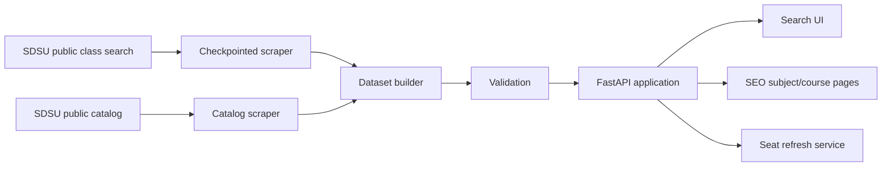

# ClassCatalog

**A faster, filterable way to explore San Diego State University classes.**

ClassCatalog is a full-stack course discovery and planning website for SDSU. It turns public class-search and catalog data into a cleaner interface with powerful filters, grouped enrollment options, professor information, seat updates, favorites, and crawlable course pages.

**Live site:** https://classcatalog.cc

> ClassCatalog is an independent project and is not affiliated with, endorsed by, or operated by San Diego State University. Enrollment, seat availability, instructor assignments, meeting times, and catalog requirements can change. Always verify important information with official SDSU sources before making registration decisions.

## Features

- **Fast class search** across supported academic terms.
- **Advanced filtering** by term, campus, subject/course text, units, requirements, grading basis, day, time, instruction mode, seat status, and program relevance.
- **Professor filters** for rating, difficulty, review count, and would-take-again percentage when rating data is available.
- **Grouped enrollment options** that preserve linked lecture, lab, activity, discussion, and other component relationships.
- **Seat status refreshes** for known classes without rebuilding the entire dataset.
- **Program-aware planning** using catalog mappings and completed-course exclusions.
- **Browser-local favorites** that stay under the user's control.
- **SEO-friendly subject and course pages** with canonical URLs and sitemap support.
- **Admin health tools** for dataset coverage, refresh status, professor matching, and targeted maintenance.
- **Resumable SDSU scraping** with checkpoints, request pacing, state recovery, partition handling, and circuit breakers.
- **Dataset validation** before data is installed into the application.

## How it works



The scraper collects course and section data from SDSU's public PeopleSoft class search. A separate catalog pipeline maps programs and requirements. The dataset builder reconciles that information into the application's normalized section inventory, validates coverage, and installs only validated data.

At runtime, FastAPI serves the search API, website assets, SEO landing pages, sitemap, admin endpoints, and optional seat-refresh services.

## Tech stack

- **Python 3.12+**
- **FastAPI**
- **Pydantic**
- **Beautiful Soup**
- **Requests / HTTPX**
- **Playwright**
- **Jinja2**
- **Vanilla HTML, CSS, and JavaScript**
- **pytest**
- **Ruff**
- **ty**

## Main commands

The project exposes command-line entry points for the major data and validation workflows:

```text
classcatalog-api                 Run the FastAPI development server
classcatalog-scrape-sdsu         Scrape SDSU public class-search data
classcatalog-scrape-catalog      Scrape SDSU public catalog mappings
classcatalog-build-dataset       Build the application dataset
classcatalog-validate-api-data   Validate installed API data
classcatalog-validate-frontend   Run frontend validation
classcatalog-import-schedule     Import supported schedule CSV data
```

With `uv`, prefix a command with `uv run`, for example:

```bash
uv run classcatalog-scrape-sdsu --help
```

## Scraping and dataset builds

The SDSU scraper is designed for long-running, resumable collection rather than aggressive request throughput. It includes conservative pacing, retry/backoff behavior, per-subject checkpoints, incremental subject output, PeopleSoft state recovery, and a circuit breaker for invalid session state.

A typical workflow is:

1. Run a **discovery pass** to inventory courses.
2. Run a separate **deep scrape** to collect course and physical-section details.
3. Build a dataset from the completed scrape outputs.
4. Run coverage and API validation.
5. Install validated data into the application.

Discovery and deep runs should use separate checkpoints because their detail limits and completion semantics differ.

See [`docs/scraper.md`](docs/scraper.md) and [`docs/dataset-build.md`](docs/dataset-build.md) for the detailed workflows.

> Please use conservative request pacing when working with SDSU's public systems. The scraper's defaults are intentionally cautious.

## Search model

ClassCatalog treats a displayed enrollment option and a physical class section as related but distinct concepts. This matters for courses that contain linked components such as a lecture plus a required lab or activity.

The grouping/reconciliation layer preserves those relationships so the UI can present a compact option without silently discarding physical sections.

Search currently supports filters including:

- academic term and campus
- free-text course/title/instructor search
- requirement tags and unit range
- grading basis
- program/catalog classification
- included and excluded weekdays
- meeting-time windows
- instruction mode
- seat status
- professor rating, difficulty, reviews, and take-again metrics

## Seat availability

ClassCatalog can refresh seat data for classes already known to the installed dataset. This is intentionally separate from structural scraping.

A seat refresh can update availability/status for an existing class, but it cannot discover a brand-new course or section that was added to SDSU after the last structural scrape. Periodic discovery/deep scrapes are still required to keep the course inventory current.

## Favorites and browser data

Favorites are stored in the user's browser rather than in a ClassCatalog account. A saved favorite can remain in local storage even if that class is no longer part of the active dataset; removal is left to the user.

## SEO pages

In addition to the interactive search interface, ClassCatalog exposes crawlable pages for subjects and courses:

```text
/subjects
/subjects/{subject-slug}
/courses/{course-slug}
/sitemap.xml
```

These pages use the same underlying repository data as the application while keeping stable canonical URLs for search engines.

## Repository layout

```text
src/classcatalog/
├── catalog/              Catalog scraping and program mappings
├── data/                 Installed application data
├── dataset/              Dataset build/install tooling
├── scraping/             SDSU class-search scraper
├── static/               Browser UI assets
├── api_validation/       API/data validation
├── frontend_validation/  Frontend validation
├── main.py               FastAPI application
├── repository.py         Data access and grouping layer
├── filters.py            Search/filter logic
├── seats.py              Seat refresh service
└── seo.py                Crawlable subject/course pages

tests/                    Automated test suite
docs/                     Scraper and dataset documentation
```

## Data freshness and accuracy

ClassCatalog combines data collected at different times and from different public SDSU surfaces. The project includes validation and refresh tooling, but no third-party course planner can guarantee that every field is current at registration time.

For registration-critical decisions, verify the class in SDSU's official class search.

Professor rating information is supplemental and may be missing, stale, or unmatched for some instructors.

## Development principles

A few invariants are especially important in this project:

- Never discard a physical class merely to simplify presentation.
- Keep linked component relationships intact.
- Treat dataset validation failures as blockers, not warnings to ignore.
- Keep structural scraping separate from lightweight seat refreshes.
- Preserve resumability so a transient PeopleSoft failure does not invalidate hours of completed work.
- Prefer public, unauthenticated SDSU data; do not add student credentials to scraper recovery flows.

## License

**Copyright © 2026 ClassCatalog. All rights reserved.**

The source code is provided for viewing and contribution purposes.

Unless a separate `LICENSE` file explicitly grants additional rights, permission is not granted to copy, redistribute, rebrand, commercially host, or publish a substantially similar version of ClassCatalog.

If you would like to use part of the project beyond viewing, learning, or contributing back to this repository, please contact the project owner first.

> Making this repository public does not automatically grant permission to reuse the source code.

## Acknowledgements

ClassCatalog relies on public information provided through SDSU's class-search and catalog systems. Professor rating information, when available, is used only as supplemental planning context.

---

Built as an independent course-search and planning project for the SDSU community.
